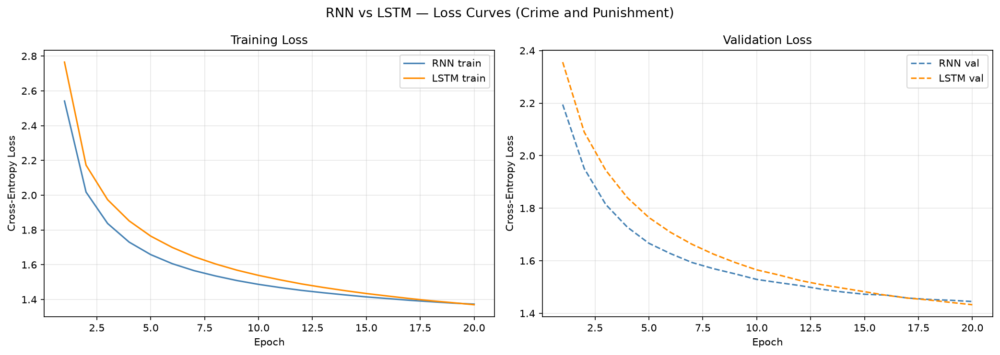
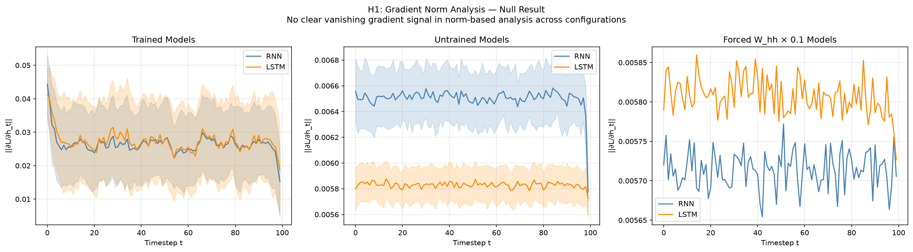
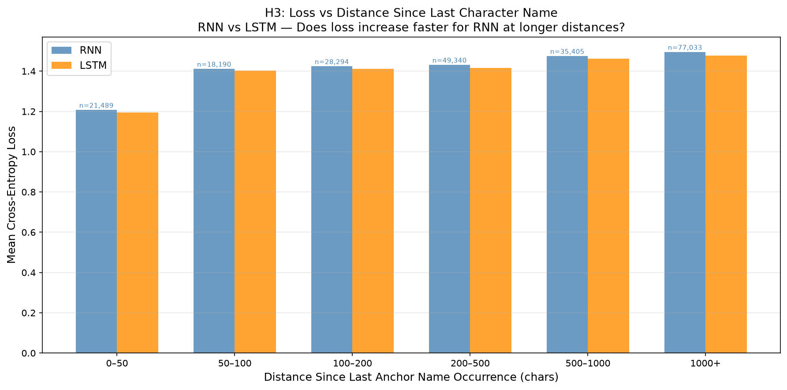
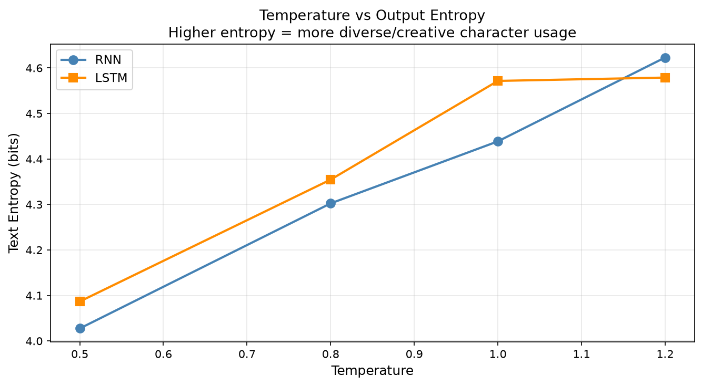

# Raskolnikov Remembers (The RNN Does Not)

### Measuring long-range context degradation in character-level language models trained on Dostoyevsky's Crime and Punishment


## The Question

> **Does the LSTM's gating mechanism let it preserve character identity and dialogue context across spans that defeat a vanilla RNN, and can we measure exactly where the RNN's context breaks down?**

We train both models on Dostoevsky's *Crime and Punishment* (1.1M characters, Project Gutenberg), chosen for its long dialogue exchanges, consistent cast of recurring characters, and rich long-range narrative structure. Two hypotheses drive the analysis:

- **H1 (Mechanistic):** Gradient norms decay across timesteps during BPTT for the RNN but stay comparatively stable for the LSTM, making the vanishing gradient problem directly visible as a measurement.
- **H2 (Empirical):** Per-character loss increases with distance-since-last-character-name-occurrence, and this increase is steeper for the RNN than the LSTM. This quantifies exactly where context breaks down.


## Results

### H1 — Gradient Norm Analysis: Null Result
Gradient norms were tracked across all 100 timesteps for both trained and untrained models, averaged over 50 test sequences across three configurations (trained, untrained, forced W_hh × 0.1). No clear vanishing gradient signal appeared in any configuration.

This is an honest null result, documented with explanation:
- **High-dimensional hidden state (256):** gradient norm is computed over all 256 dimensions jointly. Even if individual dimensions vanish, compensating dimensions keep the global norm stable.
- **PyTorch's Kaiming initialization:** designed to keep gradient magnitudes stable across timesteps out of the box, even forcing W_hh × 0.1 pushes activations toward zero where tanh's derivative is 1.0, its maximum, not its saturating regime.
- **Weight adaptation during training:** gradient clipping (max_norm=5.0) keeps W_hh's eigenvalues controlled. The trained RNN has partially compensated for vanishing gradients, a success of the training setup that paradoxically mutes the signal.

The vanishing gradient problem manifests most clearly in training dynamics, not in a single post-hoc gradient pass on a trained model. Evidence for H1 is redirected to the loss curve crossover in H2.

---

### H2 — Loss vs Distance Since Last Character Name
Six anchor names were tracked across the test set (Raskolnikov, Sonia, Razumihin, Dounia, Katerina, Porfiry). For every position in the test set, distance-since-last-anchor-occurrence was computed and positions were bucketed by distance. Mean per-character cross-entropy loss was computed per bucket for both models.

| Distance Bucket | RNN Loss | LSTM Loss | Gap |
|----------------|----------|-----------|-----|
| 0–50 chars | 1.2076 | 1.1950 | 0.0126 |
| 50–100 chars | 1.4116 | 1.4029 | 0.0087 |
| 100–200 chars | 1.4245 | 1.4106 | 0.0139 |
| 200–500 chars | 1.4316 | 1.4163 | 0.0153 |
| 500–1000 chars | 1.4752 | 1.4614 | 0.0138 |
| 1000+ chars | 1.4953 | 1.4782 | 0.0171 |

Three findings:
1. **Both models struggle more at longer distances** — loss rises monotonically from ~1.21 at 0–50 chars to ~1.49 at 1000+, confirming long-range dependencies are genuinely harder to predict.
2. **The RNN-LSTM gap widens with distance** — 0.0126 at 0–50 chars, 0.0171 at 1000+, consistent and directional across every bucket.
3. **The gap is modest but real** — both models share a 100-character truncated BPTT window. The LSTM's advantage comes from better utilizing that window, not from literally reaching back 1000 characters. Longer sequence lengths would amplify the effect.

---

### Training Dynamics
The LSTM's advantage emerges over time, not immediately:

| Epoch | RNN Val Loss | LSTM Val Loss |
|-------|-------------|---------------|
| 1 | 2.1947 | 2.3561 |
| 5 | 1.6665 | 1.7645 |
| 10 | 1.5289 | 1.5653 |
| 20 | 1.4449 | **1.4327** |

The RNN converges faster in early epochs (simpler model, fewer parameters to coordinate). The LSTM crosses over at epoch ~9 and pulls ahead through epoch 20, with its curve still descending more steeply at the end. The gap would likely widen with further training.

---

### Generation Quality
At temperature T=0.8, the LSTM generates recognizable character names mid-sequence (Raskolnikov, Marfa Petrovna) while the RNN produces only generic prose. At T=1.2, the LSTM retains character name identity even as coherence breaks down, the RNN produces `<UNK>` tokens and unrecognizable fragments. T=0.8 is the recommended generation temperature for this model/corpus combination.


## Project Structure

```
rnn-lstm-long-range-memory/
├── data/
│   ├── raw/
│   └── processed/
├── notebooks/
│   ├── 01_data_exploration.ipynb
│   ├── 02_training.ipynb
│   ├── 03_gradient_analysis.ipynb
│   ├── 04_distance_loss_analysis.ipynb
│   └── 05_generation_comparison.ipynb
├── results/
│   ├── figures/
│   ├── generated_samples/
│   └── loss_history.json
├── src/
│   ├── data.py
│   ├── rnn.py
│   ├── lstm.py
│   ├── train.py
│   └── utils.py
├── .gitignore
└── requirements.txt
```


## Methodology

### Corpus
Dostoevsky's *Crime and Punishment* (Project Gutenberg, plain text UTF-8). Translator's preface trimmed. Raskolnikov's nickname "Rodya" merged into "Raskolnikov" via whole-word regex replace before tokenization. Final corpus: 1,135,110 characters.

### Vocabulary
Built from train split only (min_count=10). Any character appearing fewer than 10 times collapses to `<UNK>`. Final vocab size: 71 characters.

### Splits
Chapter-based, not random. This preserves contiguous narrative structure for H2's distance analysis:
- **Train:** Parts I–IV (chars 0–738,058)
- **Val:** Part V (chars 738,058–897,611)
- **Test:** Part VI + Epilogue (chars 897,611–end)

### Models
Both models share identical hyperparameters except where architecture forces a difference:

| Hyperparameter | Value |
|---------------|-------|
| Embedding dim | 64 |
| Hidden size | 256 |
| Sequence length | 100 |
| Batch size | 64 |
| Optimizer | Adam (lr=0.001) |
| Gradient clipping | max_norm=5.0 |
| Epochs | 20 |

The RNN uses a hand-rolled explicit timestep loop (`nn.Linear` + `torch.tanh`) with `retain_grad()` on every hidden state for H1 analysis. The LSTM uses `nn.LSTMCell` with the same explicit loop structure, carrying both `h_t` and `c_t` between chunks.

### Training
Non-overlapping chunks of 100 characters. Hidden state detached (not reset) between chunks, truncated BPTT carries context values forward while cutting the gradient graph at chunk boundaries. Best checkpoint saved by validation loss.

### H2 Anchor Names
Six character names tracked as long-range dependency anchors: Raskolnikov, Sonia, Razumihin, Dounia, Katerina, Porfiry. Selected for frequency (80+ occurrences in train split) and narrative significance. Distance-since-last-occurrence computed in raw character coordinates, bucketed into fixed-width bins at evaluation time.


## Figures

### Loss Curves

RNN converges faster in early epochs. LSTM crosses over at epoch ~9 and maintains a lower validation loss through epoch 20 (RNN: 1.4449, LSTM: 1.4327). Both curves still descending at epoch 20 so the gap would likely widen with further training.

### H1: Gradient Norm Analysis

No clear vanishing gradient signal across three configurations (trained, untrained, forced W_hh × 0.1). See Results → H1 for full explanation.

### H2: Loss vs Distance Since Last Character Name

LSTM maintains lower loss across every distance bucket. Gap widens monotonically from 0.0126 at 0–50 chars to 0.0171 at 1000+ chars which is consistent with the hypothesis across 230,400 test positions.

### Temperature vs Output Entropy

Both models show increasing entropy with temperature. Notable crossover at T≈0.6: below it the LSTM has higher entropy (more adventurous at low temperatures), above it the RNN overtakes (collapses to chaos faster). T=0.8 is the recommended generation temperature.


## Reproducing Results

### Setup
```bash
git clone https://github.com/yourusername/rnn-lstm-long-range-memory.git
cd rnn-lstm-long-range-memory
python -m venv venv
venv\Scripts\Activate.ps1        # Windows
source venv/bin/activate          # Unix
pip install -r requirements.txt
python -m ipykernel install --user --name=rnn-lstm-long-range-memory
```

### Corpus
Download [Crime and Punishment](https://www.gutenberg.org/ebooks/2554) (Plain Text UTF-8) from Project Gutenberg. Save as `data/raw/crime_and_punishment.txt`. Trim the Gutenberg license header and footer manually before running notebooks.

### Run Order
```
01_data_exploration.ipynb       # corpus cleaning, vocab, splits
02_training.ipynb               # trains both models (~40–80 mins, CPU)
03_gradient_analysis.ipynb      # H1 gradient norm analysis
04_distance_loss_analysis.ipynb # H2 distance-loss analysis
05_generation_comparison.ipynb  # temperature sampling
```
Each notebook is independently reproducible from a clean kernel restart. Select the `rnn-lstm-long-range-memory` kernel in Jupyter before running.

### Checkpoints
Model checkpoints are not version controlled. Running `02_training.ipynb` saves `checkpoints/rnn_best.pt` and `checkpoints/lstm_best.pt` automatically. Notebooks 03–05 load from these checkpoints.


## Limitations and Future Work

### Current Limitations
- **Truncated BPTT at seq_len=100** is the dominant constraint. Neither model sees more than 100 characters at once during training. The LSTM's advantage in H2's 1000+ bucket reflects better utilization of a 100-character window, not literal 1000-character memory. Longer sequence lengths would amplify the effect significantly.
- **CPU-only training** limits sequence length, batch size, and epoch count. Both models were still converging at epoch 20. The LSTM's advantage would likely widen with further training.
- **H1 null result** — norm-based gradient analysis did not produce a clear vanishing gradient signal due to PyTorch's Kaiming initialization and high-dimensional hidden state averaging. The effect is real but not directly visible via this measurement approach.

### Future Work
- **Increase seq_len to 500–1000** on a CUDA GPU — this is where the RNN/LSTM gap would become dramatic rather than modest.
- **Extend training to 40–50 epochs** — both models' loss curves were still descending at epoch 20.
- **Replace these models with a Transformer** — attention mechanisms sidestep the truncated BPTT constraint entirely by directly attending to any position in the sequence regardless of distance. This project's results motivate exactly why "Attention Is All You Need" (Vaswani et al., 2017) was necessary.


## References

- Hochreiter, S., & Schmidhuber, J. (1997). Long Short-Term Memory. *Neural Computation, 9*(8), 1735–1780.
- Vaswani, A., et al. (2017). Attention Is All You Need. *NeurIPS*.
- Dostoevsky, F. (1866). *Crime and Punishment*. Project Gutenberg: https://www.gutenberg.org/ebooks/2554